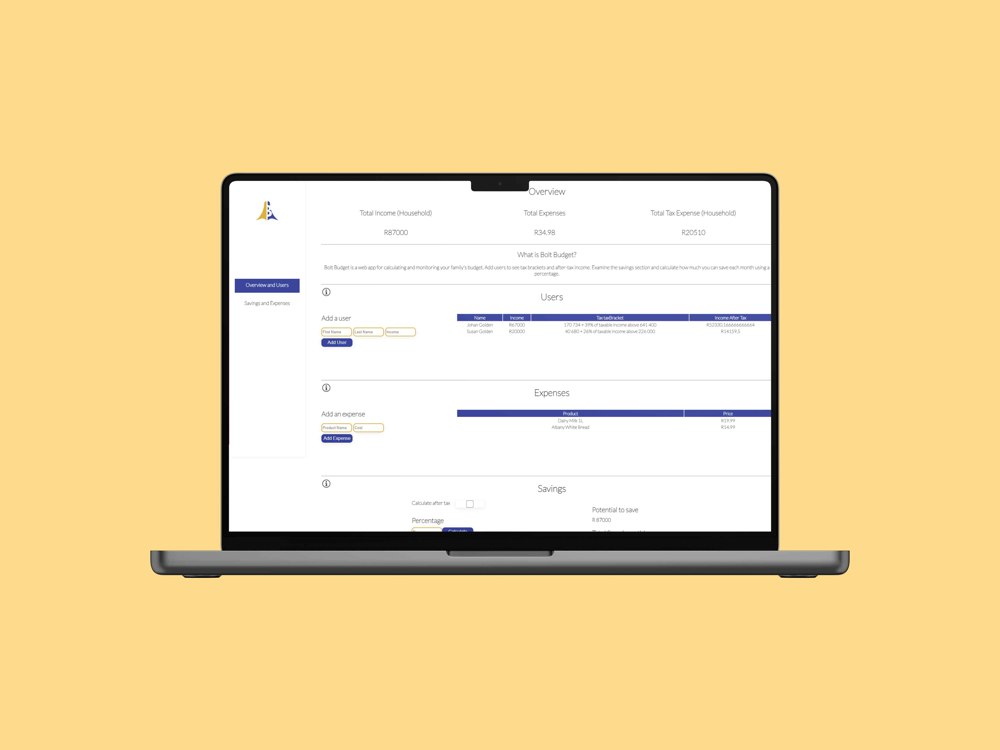

## Repo Info


Reinhardt de Beer
21100115 - DV_202_V2

# Bolt Budget - Unit Testing

A web application designed for estimating your family's budget, as well as implementing, testing, and repairing unit tests!


;


## Table of contents

* [Installation](#Installation)
    * [Depebdancy Documentation](#Dependancies-Utilized)
* [Dependancies-Utilized](#Dependancies-Utilized)
* [Features](#Features)
    * [Feature-Screenshots](#Feature-Screenshots)
* [Ideation](#Ideation)
* [Development-Process](#Development-Process)
* [Final-Outcome](#Final-Outcome)
    * [Mockups](#Mockups)
    * [Video-Demonstration](#Video-Demonstration)
    * [Final-Outcome](#Final-Outcome)
* [Authors](#Authors)
* [License](#License)
* [Contact](#Contact)
## Installation

1. GitHub Desktop
Enter `https://github.com/EpicBlue1/boltbudget.git` into the URL field and press the `Clone` button.

2. Clone Repository
Run the following in the command-line to clone the project:
   ```sh
   git clone https://github.com/EpicBlue1/boltbudget.git
   ```
    Open `IDE` and select `File | Open...` from the menu. Select cloned directory and press `Open` button

3. Install Dependencies
Run the following in the command-line to install all the required dependencies:
   ```sh
   npm install
   ```

4. An API key is not required## Dependancies Utilized

## Dependancies Utilized

| Name              | Link                                                                     |
| ----------------- | ------------------------------------------------------------------------ |
| React Documentation |  https://reactjs.org/ |
| Jest Documentation  |  https://jestjs.io/docs/expect |
| React Router Dom    |  https://v5.reactrouter.com/web/guides/quick-start |


## Features

- Light/dark mode toggle
- Live previews
- Fullscreen mode
- Cross platform


## Feature Screenshots  
#### Section One

#### Section One

#### Section One

#### Section One


# Ideation
[Pinterest Board For Concept](https://za.pinterest.com/debeer0072/unit-testing-website/)
### Wireframes


## Development Process

* Utilized React `Charts.JS` dependency for Data visualization
* Utilized React `<Model-Viewer>` dependency for 3D interactable globe
* Utilized React `Sxios` dependency to make api calls
* Implemented Routing with `React-Router v6`.
* API End Point: https://api.nasa.gov/#browseAPI 

## Challenges

* Utilized React `Charts.JS` dependency for Data visualization
* Utilized React `<Model-Viewer>` dependency for 3D interactable globe
* Utilized React `Sxios` dependency to make api calls
* Implemented Routing with `React-Router v6`.
* API End Point: https://api.nasa.gov/#browseAPI 

## Final Outcome

### Mockups





### Promotional Video

To see a run through of the application, click below:

[View Demonstration](https://youtu.be/_ifrJrLPCv0)

### Video Demonstration

To see a run through of the application, click below:

[View Demonstration](https://youtu.be/_ifrJrLPCv0)

## Authors

* **Reinhardt de Beer** - [EpicBlue1](https://github.com/EpicBlue1)

## License

Distributed under the MIT License. See `LICENSE` for more information.\

## Contact

* **Reinhardt de Beer** - [21100115@virtualwindow.co.za](mailto:21100115@virtualwindow.co.za) - [@rdb_fotopatat](https://www.instagram.com/rdb_fotopatat/) 
* **Project Link** - https://github.com/EpicBlue1/boltbudget